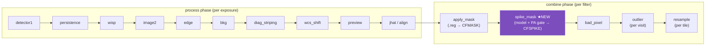
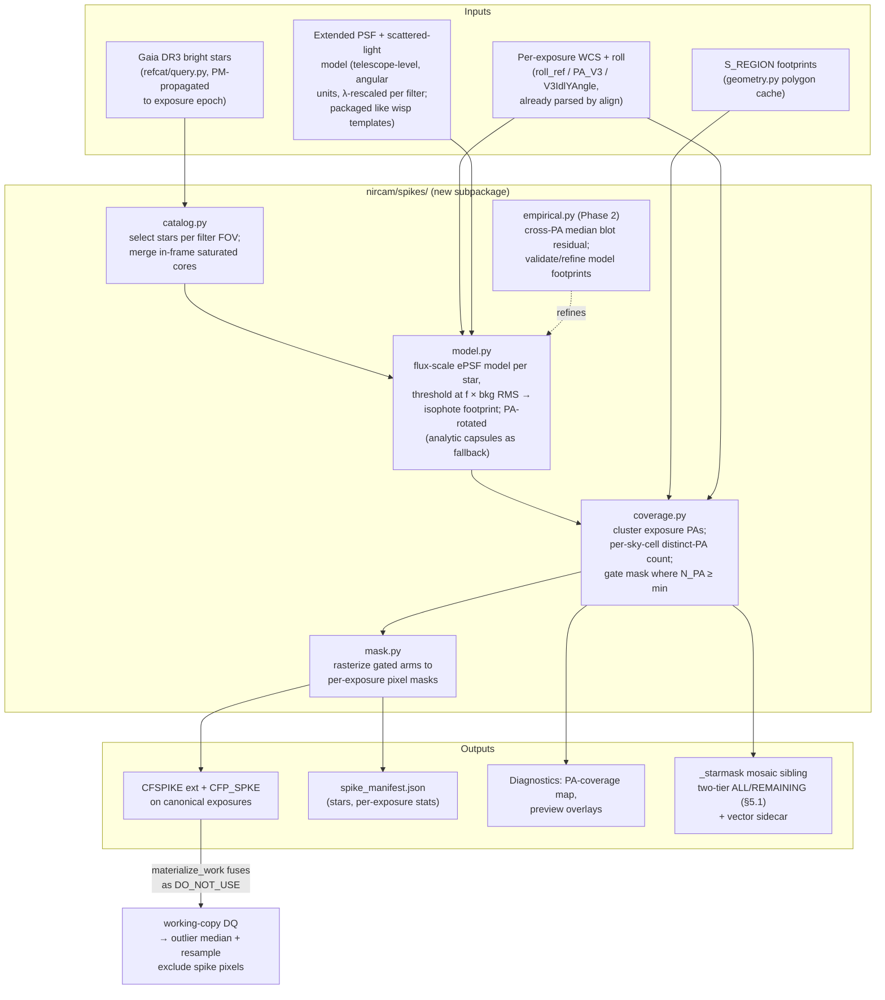
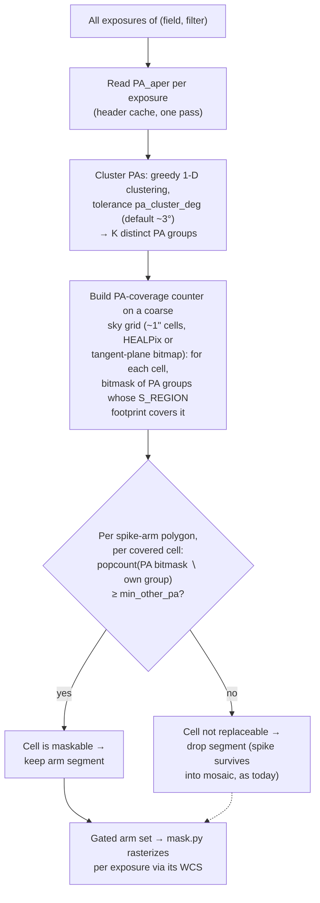
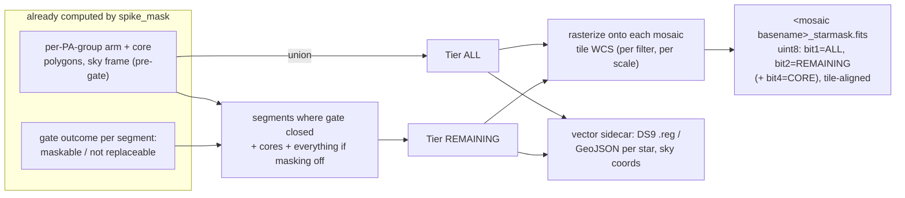
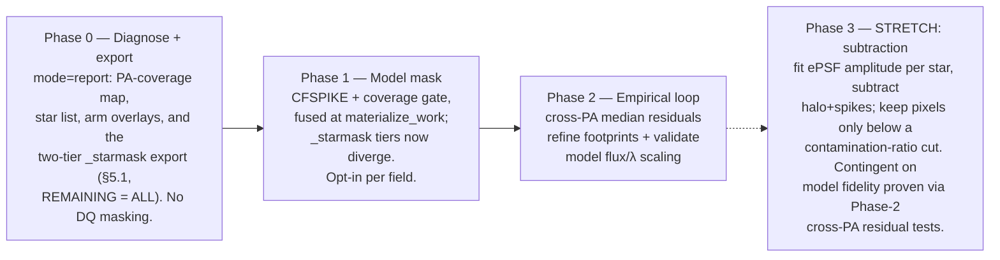
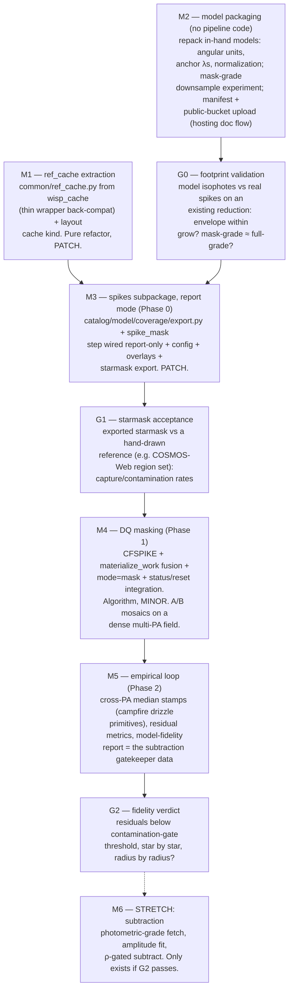

# Design: Automatic Diffraction-Spike Masking for Multi-PA NIRCam Fields

Status: **exploratory sketch** — no implementation yet. Stretch goal for future
NIRCam reductions.

## 1. Problem

Bright stars imprint diffraction spikes (six spikes at 60° spacing from the
hexagonal primary, plus the horizontal secondary-strut spike) that extend
arcminutes across NIRCam exposures at the bright end. In the mosaic they
produce spurious sources, corrupted photometry along the spike wings, and
false structure in background maps.

The pipeline currently has no automatic defense against them:

- **Outlier detection can't see them — structurally.** `outlier` groups
  exposures per visit with intra-program overlap padding
  (`nircam/steps/outlier.py`). Every exposure in such a group shares one
  telescope roll, so a spike sits at the *same sky position* in every input.
  It is perfectly self-consistent, survives the median, and is never flagged.
  This is not a tuning problem; it's the grouping itself.
- **Manual `.reg` masks** (`apply_mask` → `CFMASK`) work but don't scale to
  fields with hundreds of bright stars and thousands of exposures.

**The multi-PA opportunity.** Spikes rotate with the telescope V3 position
angle; the sky does not. In densely-imaged fields assembled from multiple
programs/epochs (COSMOS-Web-style), most pixels are covered at ≥2 distinct
PAs. A pixel under a spike at PA₁ is clean in the PA₂ exposures — so spike
pixels can be *masked outright* in the exposures where they're contaminated,
and the mosaic still has full sky coverage from the other roll(s). Where only
one PA exists, masking would punch holes in the mosaic, so the mask must be
**coverage-gated**.

This is the same "earns its keep only at high N" regime as `bad_pixel`, and
the design borrows its posture: **disabled by default, opted in per field.**

### 1.1 Prior art: JADES DR5 (Johnson et al. 2026, arXiv:2601.15954)

The JADES DR5 NIRCam reduction does exactly this — coverage-gated,
multi-PA spike removal — but manually, and at the mosaic level rather than
per exposure (their §3.3.1, §3.3.6, §4.3.7):

- Exposures are first combined into **"subregion" mosaics grouped by (PID,
  epoch, PA)** — PAs within ±1° form one group — partly *because* mixing
  PAs "would lead to a complicated, spatially variable effective PSF with
  many diffraction spikes," and explicitly so that "when there are
  multiple PAs covering a region, this also allows us to recover area
  under the diffraction spikes of bright stars."
- Spike masks are **drawn by hand via visual inspection** of each
  subregion mosaic and stored as `NIM = −2` in the coverage layer.
- At full-mosaic coaddition, `NIM = −2` pixels contribute **only if no
  other subregion has a valid pixel there** — i.e. spike data are replaced
  by clean other-PA data where possible and *retained* (no hole) where
  they are the only coverage. A small subset of stars/filters get forced
  censoring (`NIM = −4`) regardless.
- Failure modes they report: **"orphan" spike segments** where the
  supporting other-PA data run out mid-arm; **interacting masks** for
  close stars whose arms at different PAs overlap; and filter-by-filter
  inconsistency (a spike masked in some bands, visible in others).
- Their §4.3.7 closes with: "alternative handling of the diffraction
  spikes would be best done in the subregion mosaics, **before the
  coaddition**" — i.e. upstream, which is where this design operates
  (per-exposure DQ, before outlier/resample).

Mapping to this design: our PA-coverage gate encodes the same invariant as
their NIM = −2 semantics (never lose sky — only mask what another PA can
replace), with three deltas: (a) the masks are **automated** (ePSF model +
Gaia) instead of hand-drawn; (b) they live **per exposure**, so outlier
detection also benefits and the JADES failure modes are addressed
structurally — the sky-frame gate ends arms exactly where replacement
coverage ends (no orphans), and subtracting each PA group's own spike
footprint from its coverage contribution handles interacting close-star
arms; (c) the mask is recorded non-destructively (`CFSPIKE`), so it stays
reversible and reviewable. The filter-by-filter caveat applies to us
identically (the step is per-filter by construction) — inherited, not
solved.

A useful side-fact from their Appendix B: they PSF-fit **Gaia star
positions using the diffraction spikes themselves** (cores saturated) and
achieve 1–2 mas exposure-to-exposure repeatability — strong evidence that
fitting the model to spikes/wings, never the core, is sufficient for the
centering and amplitude fits in §3.2.

## 2. Where it sits in the pipeline

A new per-filter ensemble step, `spike_mask`, in the **combine phase**,
between `apply_mask` and `bad_pixel`:

```python
COMBINE_STEPS = [
    ('apply_mask', 'CFP_MASK'),
    ('spike_mask', 'CFP_SPKE'),   # NEW — per-filter ensemble, gated on multi-PA coverage
    ('bad_pixel',  'CFP_BPIX'),
    ('outlier',    'CFP_OUT'),
    ('resample',   None),
]
```

Rationale for the slot:

- **Combine, not process.** The step is inherently an *ensemble* decision —
  the gate ("is this sky region covered at another PA?") depends on the whole
  filter's exposure set, which isn't knowable per-exposure during the process
  phase. It also wants post-`wcs_shift`/`jhat`/`align` WCS quality.
- **Before `outlier`.** Fusing spike pixels into the working DQ as
  `DO_NOT_USE` removes them from the cross-exposure median
  (`good_bits='~DO_NOT_USE'`), so the outlier median is no longer biased by
  spike wings on overlap regions — the two steps reinforce each other.
- **After `apply_mask`.** Manual `.reg` masks stay the last word for anything
  the automatic step misses; the two masks are independent extensions and
  simply OR together at `materialize_work` time.



### Non-destructive contract (the CFMASK pattern)

`spike_mask` writes a **`CFSPIKE`** extension (uint8, 0/1) on each canonical
exposure and stamps `CFP_SPKE`. The canonical's SCI/DQ are untouched.
`Field.materialize_work` fuses `CFSPIKE` into the working DQ as `DO_NOT_USE`,
exactly as it already does for `CFMASK`. Consequences, all inherited for free:

- Mask edits/re-runs are fully reversible — `CFSPIKE` is rebuilt from scratch.
- The canonical stays deploy/review-clean (byte-identical modulo the added
  extension).
- Exposures with no spike coverage get `CFP_SPKE = 'no bright stars'` (the
  `apply_mask` "ran-but-n/a" convention) so `status` reads correctly.

## 3. Architecture

Two stages: a **model-driven** mask (Phase 1, a priori geometry from a bright-
star catalog) optionally refined by an **empirical** cross-PA residual
detector (Phase 2). Both feed a shared **coverage gate**.



### 3.1 Bright-star catalog (`catalog.py`)

- Primary source: **Gaia DR3** via the existing `refcat/query.py` backend
  (astroquery, `mag_band="G"`), with proper-motion propagation to the
  exposure epoch — `refcat/motion.py` already does this for alignment.
  Query once per field (cone from the union footprint), cache under the
  field's reference dir alongside the alignment refcat.
- Selection: `G < mag_limit` (per-channel default, e.g. SW ~ 15.5, LW ~ 15;
  tunable). Spike length is a steep function of magnitude, so the faint
  cutoff mostly controls mask *count*, not mask *area*.
- Fallback / supplement: in-frame detection of saturated cores
  (`SATURATED` DQ clusters) catches red sources that are spike-bright in
  LW but faint in Gaia G. Positions from the cluster centroid; "effective
  magnitude" from the saturated-core radius.

### 3.2 Spike footprint model (`model.py`)

Primary backend: an **empirical extended PSF + scattered-light model** of
the telescope optics, used as a *footprint generator*, not a photometric
model. Per bright star:

1. Predict the star's flux in the exposure's filter (Gaia G with a BP–RP
   color term; refine by fitting the model amplitude to unsaturated wing
   pixels in-frame — the model itself enables this).
2. Scale the model, threshold at `f × local background RMS` — **the
   isophote is the mask**. The mag–length relation falls out of the model
   photometry for free, and the footprint auto-adapts to survey depth
   (deeper data → spikes detectable further out → larger isophote at fixed
   threshold), which is exactly the wanted behavior. No hand-calibrated
   `L(mag, filter)` table.
3. Polygonize the thresholded isophote in sky coordinates (shapely,
   consistent with `geometry.py`) — the coverage gate operates on
   polygons regardless of backend — then project per-exposure for
   rasterization. Orientation from the same
   `roll_ref`/`V3IdlYAngle`/`vparity` chain `align/apply.py` and
   `outlier_detect.py` already compute.

The model is **telescope-level, not per-filter** — spike geometry is set by
the pupil (hexagonal primary → six arms at 60°, plus the secondary-strut
"+") and filter-level features (e.g. LW ghosts) are second order for
masking. It is not achromatic, though: diffraction structure scales
radially ∝ λ (a factor ~5 across 0.9–4.4 μm, on top of the SW/LW pixel-
scale difference). The in-hand models exist at **several distinct
wavelengths**, which is the ideal shape: pick the nearest anchor
wavelength per filter and apply the small residual radial rescale
`λ_pivot / λ_anchor` — the ∝ λ diffraction scaling is then only ever
interpolating between measured anchors, never extrapolating across the
full 5× range. Still not a per-filter model. Wavefront-epoch drift (breathing) is
well below mask tolerance + `grow`; a single post-commissioning ePSF
suffices. This also buys what capsules structurally can't: the scattered-
light halo, asymmetric wings, and the correct relative strut-arm strength.

Fallback backend: **analytic capsule arms** (6 primary + 2 strut, mag- and
λ-scaled length/width from a small packaged coefficient table) for regimes
outside the model's validity — stars bright enough that spikes exceed the
model's radial extent — and for cheap Phase-0 overlays. Not full PSF
*simulation* (WebbPSF is far too heavy and unnecessary here).

Practical weak links to watch: flux prediction for red stars (Gaia G →
NIRCam LW is the main error source; the in-frame amplitude fit is the
mitigation) and centering on saturated cores (fit the wings/spike cross,
never the core — JADES DR5 gets 1–2 mas repeatability fitting Gaia star
positions from the spikes alone, see §1.1).

### 3.3 The PA-coverage gate (`coverage.py`) — the heart of the design

The invariant: **never mask a pixel that no other-PA exposure can replace.**



Notes:

- The gate is computed **in sky coordinates once per filter**, not per
  exposure — arms are clipped against the "maskable" region, then the
  clipped geometry is projected into each exposure. Cheap, and guarantees
  cross-exposure consistency: the same sky segment is either masked in
  *all* exposures of the contaminated PA group or in none.
- Coarse cells (~1") are fine: S_REGION is only good to ~1" anyway
  (`geometry.py` already documents this), and the gate is a coverage
  question, not astrometry.
- A refinement worth keeping in mind: an arm from a star at PA₁ can overlap
  an arm from the *same* star at PA₂ near the star (arms cross at the
  core). Cells where the candidate replacement exposures are *themselves*
  spike-flagged should not count as coverage. Practically: compute all arm
  sets first, subtract each PA group's own spike footprint from its
  coverage contribution, then gate. This makes the core region (all PAs
  contaminated) correctly un-maskable → it stays a job for `apply_mask` or
  simply saturation DQ.
- `min_other_pa = 1` (default): at least one clean PA group must cover the
  cell. Fields observed at a single PA get an empty gate everywhere and the
  step becomes a no-op with a clear log line — safe to leave enabled in
  shared config, but still ship `enabled = false` by default (bad_pixel
  precedent).

### 3.4 Model distribution: generalize the `wisp_cache` pattern

The full PSF + scattered-light model set at NIRCam wavelengths is
**~5.8 GB** — too big to ship in the wheel, same regime as the wisp
templates (~2.5 GB), and the pipeline already solved this problem once.
`nircam/wisp_cache.py` is a manifest-driven fetch+cache engine: a
checksummed manifest ships inside the package (`data/wisp_manifest.toml`
with `base_url` + per-file sha256/bytes), files are fetched lazily by
plain anonymous-HTTPS GET from a public R2 bucket, streamed to a sibling
`.part` and atomically renamed after size+sha256 verification, cached
under a registered `campfire_layout.cache_path` kind, and **fail loud**:
listed-but-unfetchable is a hard error, not-listed is a visible
"no template" stamp. `WISP_TEMPLATE_HOSTING.md` documents the bucket
half (public bucket, flat namespace, version segment in the path).

Plan: **extract the engine, don't fork it.** Lift the generic core
(manifest load, `ensure(names)`, `_download_one`, cache-dir resolution)
into a shared `common/ref_cache.py` parameterized by
(manifest path, cache kind); `wisp_cache` becomes a thin wrapper over it,
and spike models get their own `data/spike_model_manifest.toml` +
`cache/spike_models/` (one new `_CACHE_KINDS` entry in campfire-layout).
The hosting doc and `scripts/build_wisp_manifest.py` pattern carry over
as-is.

Two things keep the 5.8 GB from ever being felt in practice:

- **Lazy, per-anchor fetch.** `ensure()` is per-file; a run needs only the
  nearest-anchor model(s) for the field's filters, so a typical reduction
  pulls a fraction of the set, once per machine.
- **Two grades in the manifest.** Masking (Phases 0–2) needs footprint
  shape only — so publish a **mask-grade** repack (downsampled /
  clipped-dynamic-range, plausibly tens–hundreds of MB total) alongside
  the **photometric-grade** originals. Phases 0–2 fetch mask-grade by
  default; the full-fidelity files are fetched only if/when the Phase-3
  subtraction stretch goal graduates (§6). A config knob
  (`model_grade = "mask" | "photometric"`) selects, and the manifest
  lists both so the choice is a fetch decision, not a repackaging event.

Preflight mirrors wisp semantics: a filter whose anchor is listed but
unfetchable hard-fails the step; a filter with no listed anchor logs
visibly and falls back to the analytic capsule backend (§3.2) rather than
silently skipping.

### 3.5 Empirical refinement (`empirical.py`, Phase 2)

The model mask is deliberately conservative; real spikes vary (filter
ghosts, PSF breathing, scattered-light features). Phase 2 closes the loop
with data:

- Build a **cross-PA median** per spike neighborhood: reuse the
  campfire-native drizzle primitives (`drizzle.drizzle_tile_singles`,
  `MedianComputer`, blot — all built for `outlier_step_campfire`) over a
  small tangent-plane stamp around each bright star, drawing inputs from
  *all* PA groups. Spikes don't stack across PAs, so the median is
  spike-suppressed.
- Blot back to each exposure; flag elongated positive residuals **within a
  corridor around the predicted arm directions** (the model constrains the
  search, killing false positives from real extended sources).
- Output feeds two places: (a) per-exposure mask refinement (extend/trim
  footprints), and (b) validation of the ePSF model's flux scaling and λ
  rescaling against real data (systematic over/under-masking → adjust the
  threshold `f` or the color term, not the model).

This is strictly additive — Phase 1 is useful alone, and Phase 2 never runs
for single-PA fields (no cross-PA median exists).

## 4. Configuration

```toml
[nircam.spike_mask]
    enabled = false            # opt in per field, like [nircam.bad_pixel]
    mag_limit_sw = 15.5        # Gaia G cutoff, SW filters
    mag_limit_lw = 15.0        # Gaia G cutoff, LW filters
    include_saturated = true   # supplement catalog with in-frame saturated cores
    model = "epsf"             # "epsf" (extended PSF isophote) | "capsule" (analytic fallback)
    model_grade = "mask"       # "mask" (footprint-grade repack) | "photometric" (full 5.8 GB set, Phase 3) — §3.4
    threshold_sigma = 1.0      # f in "model SB > f × local background RMS" isophote cut
    pa_cluster_deg = 3.0       # exposures within this roll tolerance = one PA group
    min_other_pa = 1           # distinct other-PA groups required to gate a cell in
    grow = 2                   # binary dilation (px) on the rasterized mask
    mode = "mask"              # "mask" (DO_NOT_USE) | "report" (diagnostics only)
    export_starmask = true     # write the two-tier _starmask mosaic sibling (§5.1);
                               # independent of mode — report-mode runs still export
```

Parametric-only, per the config contract — it controls *how* the step runs;
whether it runs at all follows the same `enabled` opt-in pattern as
`bad_pixel`. `mode = "report"` is the Phase-0 dry-run: produce the coverage
map, manifest, and overlays without writing `CFSPIKE`.

## 5. Products & provenance

| Product | Location | Notes |
|---|---|---|
| `CFSPIKE` extension | canonical exposure FITS | uint8; rebuilt every run |
| `CFP_SPKE` stamp | canonical primary header | value records mag limits + gate params, or "n/a" reason |
| `spike_manifest.json` | `products/nircam/<field>/<filter>/` | star list, PA groups, per-exposure masked-pixel counts; follows `manifest.py` conventions (input hashes → cheap re-run skip) |
| PA-coverage map | field reference dir | small FITS/PNG diagnostic: distinct-PA count per sky cell — independently useful for survey planning |
| Preview overlays | filter products dir | predicted arms drawn over the existing `preview` PNGs |
| `_starmask` mosaic sibling | `field.filter_dir(filter)` | two-tier star/spike bitmask on the mosaic grid + vector sidecar — see §5.1 |

Effects downstream, all via existing mechanisms: `outlier` and `resample`
exclude the pixels through `good_bits='~DO_NOT_USE'`; `expmap`/WHT drop
accordingly (honest depth accounting — masked spike area at single-PA depth
shows as reduced weight, not fabricated data).

### 5.1 Star-mask export: a two-tier sibling product of the mosaics

Hand-drawn star masks are one of the most labor-intensive artifacts of
survey production (days of region-drawing for a COSMOS-Web-scale field).
The machinery above computes everything a star mask contains as a
*byproduct* — so export it as a first-class product, regardless of whether
DQ masking is enabled or even possible. This is the piece that pays off
**even in single-PA fields**, where the coverage gate never opens.

Two tiers, from the two geometry sets the step already holds:

- **Tier ALL** — the union of predicted star/spike footprints over every
  exposure that contributed to the mosaic, *pre-gate*. "A star's optics
  touched this pixel in at least one input, whether or not it was cleaned."
  This is the conservative mask for depth-critical work (completeness
  sims, number counts near the confusion limit).
- **Tier REMAINING** — footprint segments still contaminated in the
  delivered mosaic: arm segments the gate could not open (no clean
  other-PA coverage), everything when `spike_mask` is disabled or in
  `report` mode, and the always-contaminated cores. "Do not trust
  photometry here." This is the mask that replaces the hand-drawn one.

`REMAINING ⊆ ALL` by construction, and `ALL ∖ REMAINING` is itself
informative: "was spike-contaminated, cleaned by other-PA data" — a
natural per-source quality flag for catalogs.



Design points:

- **Pixel + vector, both.** The raster ships as a `_starmask.fits` sibling
  alongside the existing `_sci/_err/_wht/_srcmask` split — same tile grid,
  same version-free basename convention — so photometry code applies it
  with one array op. The vector sidecar (per-star polygons in sky
  coordinates, tagged by tier, star ID, magnitude) is the human- and
  web-friendly form: reviewable, editable, and convertible into the
  existing `.reg` → `apply_mask` flow when a hand fix *is* needed —
  the export becomes the starting point instead of a blank canvas.
- **Computable from Phase 0.** Tiers derive from the model geometry, the
  PA-coverage gate, and headers — no pixel data, no DQ mutation. The
  export therefore lands with `mode = "report"`, before any masking ships,
  and is immediately useful on fields where masking will never be possible
  (single PA → `REMAINING = ALL`, which is exactly the hand-drawn-mask
  replacement).
- **Truthfulness rule.** Tier REMAINING must reflect what actually entered
  the drizzle: segments count as cleaned only if the corresponding
  exposures carried `CFSPIKE` when `resample` ran (the manifest records
  this), so a report-mode run or a stale re-run can't claim cleaning that
  didn't happen.
- **Cheap.** uint8, spike-sparse, RLE/gzip-compressed FITS — negligible
  next to the mosaics; the vector form is KB-scale.
- Downstream hooks (out of scope here, noted for later): catalog
  cross-match sets per-source spike flags from the tiers — the web
  portal's bitmask flag machinery (`web/lib/flags.ts`) is a natural
  landing spot; deploy ships `_starmask` wherever `_srcmask` already goes.

## 6. Phasing



**Masking (Phases 0–2) is the plan of record; subtraction (Phase 3) is a
stretch goal.** The two demand very different things from the model:
masking only needs the *footprint shape* — it is tolerant of flux-
prediction and normalization errors (a mask slightly too big costs a
little gated depth; `grow` already assumes imprecision) — while
subtraction needs **percent-level photometric fidelity** in the model
profile, which is unproven for the in-hand models. Phase 3 therefore
stays dashed until the Phase-2 machinery has quantified model fidelity:
the cross-PA median around each star is spike-free ground truth, so
`(exposure − model) − blotted median` residuals measure exactly the error
that subtraction would leave behind, star by star, radius by radius. Only
if those residuals are consistently below the contamination-gate
threshold does subtraction graduate from stretch goal to phase.

Phase 1 ships as an **Algorithm** changelog entry (MINOR — it changes pixel
values in the mosaic for fields that enable it, even though the default-off
config means no change for existing fields until opted in). Phase 0 alone is
Infrastructure (PATCH).

### 6.1 Build plan

Six milestones, each one PR, each independently shippable and useful on
its own. M1 ∥ M2 can proceed in parallel (no shared code); everything
else is a chain. Validation gates (G0–G2) sit *between* code milestones —
they are analysis deliverables, not merges, and each one de-risks the
next milestone before it's built.



Per-milestone notes:

- **M1 (`common/ref_cache.py`)** — behavior-preserving refactor;
  `test_wisp_cache.py` keeps passing unmodified against the wrapper, new
  engine-level tests use a throwaway manifest. Lands any time; nothing
  waits on it except M3's fetch path. Infrastructure/PATCH.
- **M2 (model packaging)** — no pipeline code: a repack script (sibling of
  `scripts/build_wisp_manifest.py`), the manifest, the bucket upload, and
  the mask-grade downsample experiment whose output feeds G0. The G0
  notebook/script itself belongs in `pipeline/experiments/` (existing
  convention).
- **G0** answers two questions before M3 exists: does the scaled model
  isophote actually envelope real spikes to within `grow` across
  mag/filter, and how far can mask-grade be downsampled before isophotes
  drift. Cheap to run against any existing reduction; kills or corrects
  the model assumptions while they're still cheap to change.
- **M3 (report mode)** — the biggest single PR; everything in
  `nircam/spikes/` plus orchestrator wiring, but zero pixel mutation
  (`mode = "report"` is the only mode). Ships the starmask export (§5.1),
  so it delivers the labor-saving product first, on every field, before
  masking exists. Tests follow the repo's synthetic-fixture conventions
  (`test_nircam_*`: fabricated WCS/PA headers, golden gate geometries,
  single-PA no-op, close-star interaction cases). Infrastructure/PATCH.
- **G1** — quantitative starmask acceptance against a hand-drawn reference
  mask: what fraction of hand-masked area the export captures (target ≈
  all of it) and how much extra it masks (tolerable overshoot). This is
  the go/no-go for trusting the same geometry as DQ masks in M4.
- **M4 (mask mode)** — small diff (CFSPIKE write, `materialize_work`
  fusion, `mode = "mask"`, `status`/`reset --from` integration) but the
  first pixel-affecting change, so it carries the A/B mosaic validation
  and the **Algorithm/MINOR** changelog entry. Depth accounting checked
  via expmap/WHT on the A/B pair.
- **M5 (empirical loop)** — reuses the campfire-native drizzle/median/blot
  primitives; its product is a *report* (per-star, per-radius residuals),
  not a pixel change, and doubles as the G2 dataset. Refinement of
  footprints from residuals can ship here too (Algorithm if it alters
  masks).
- **M6 (subtraction)** — spec'd in open question 1 (§7); built only if G2 passes, and gets
  its own design pass at that point (amplitude fitting, ERR propagation,
  ρ-gate defaults) informed by real G2 numbers.

The rollout risk profile follows from the ordering: M1–M3 cannot change a
single science pixel by construction; M4 is the first that can, and it
arrives with the gate evidence (G0, G1) already in hand, on an opt-in
flag, in the same PR as its A/B validation.

## 7. Open questions

1. **Hard mask vs. subtraction — masking is the plan of record;
   subtraction is a stretch goal pending model validation.** DO_NOT_USE
   discards spike-wing pixels that still carry mostly valid flux, and with
   a good enough scattered-light model the alternative is **model
   subtraction** (Phase 3, stretch): fit the amplitude per star, subtract
   halo+spikes (the `wisp` pattern at combine time) — keeping depth in the
   wings, and working even in single-PA fields where the coverage gate
   never opens. But a subtracted pixel is only as good as the model, and a
   pixel that was *dominated* by spike flux before subtraction should not
   be trusted afterward: residual fractional model error there exceeds the
   science signal, and the Poisson noise of the removed flux remains in
   the pixel regardless. If subtraction ever ships, the subtract/mask
   decision is therefore **per pixel, gated on a contamination ratio** —
   ρ = model SB / max(local background RMS, science SB): subtract-and-keep
   where ρ < ρ_max (spike is a perturbation; inflate ERR/VAR by the model
   uncertainty so drizzle weights stay honest), hard-mask where ρ ≥ ρ_max.
   ρ_max → 0 degenerates to pure Phase-1 masking, and both contours are
   two thresholds of the same scaled model. **Gatekeeper:** the Phase-2
   cross-PA residual tests (see §6) must first demonstrate percent-level
   model fidelity — masking needs only footprint shape, subtraction needs
   photometry, and the in-hand models are validated for neither yet.
   (Weight-downweighting was considered and dropped — if the model is good
   enough to downweight against, it's good enough to subtract; if not,
   masking is the honest option.)
2. **Saturated-core handling.** The core/halo region is typically
   contaminated at *every* PA and thus never gated in. Do we want an
   ungated central-disk option (`mask_core = true`) that accepts the mosaic
   hole, or leave cores to DQ saturation + manual masks? Leaning: leave it
   out of scope; the feature is about *spikes*.
3. **PA grouping vs. per-visit outlier interaction.** Should `outlier` gain
   an optional cross-PA grouping mode instead? Rejected for now: the
   redundant-drizzle scaling problem that motivated intra-program grouping
   (see `outlier.py`) comes right back, and spikes are better handled
   deterministically than statistically. But Phase 2 deliberately reuses the
   same drizzle/median/blot primitives, so the machinery converges.
4. **Astrometric epoch for arms.** Arms rotate about the star, so mask
   accuracy near the arm tip is sensitive to PA error, not star position.
   S_REGION-level (~1") accuracy suffices given `grow`; no need to wait for
   `align` refinement — but running after it in the combine phase gets the
   better WCS for free anyway.
5. **Filter dependence of the strut spikes.** The horizontal strut arms are
   weak in SW, prominent in LW. The ePSF isophote handles this naturally
   (strut arms simply fall below threshold at SW flux levels) — but if the
   model is single-channel, verify the λ rescaling doesn't over-mask struts
   in SW; the capsule fallback table should allow per-arm zero lengths.
6. **ePSF model provenance & format.** In-hand scattered-light models
   exist at several distinct anchor wavelengths (nearest-anchor +
   residual λ rescale per filter, per §3.2); the set totals ~5.8 GB and
   distributes via the generalized `wisp_cache` engine (§3.4). Remaining:
   their angular extent vs. the brightest stars in target fields
   (determines whether the capsule fallback is ever exercised),
   normalization convention, and the mask-grade repack parameters
   (how far the models can be downsampled before footprint isophotes
   move by more than `grow`).

## 8. Summary of touchpoints

| Area | Change |
|---|---|
| `nircam/orchestrate.py` | add `('spike_mask', 'CFP_SPKE')` to `COMBINE_STEPS`; per-filter ensemble runner (bad_pixel pattern) |
| `nircam/spikes/` (new) | `catalog.py`, `model.py`, `coverage.py`, `mask.py`, `export.py` (§5.1 star-mask tiers), `empirical.py` (Phase 2) |
| `nircam/field.py` | `materialize_work`: fuse `CFSPIKE` alongside `CFMASK` |
| `nircam/steps/resample.py` | rasterize `_starmask` tiers onto each tile WCS after drizzle (sibling of the `_sci/_err/_wht/_srcmask` split) |
| `nircam/steps/outlier.py` | none (benefits automatically via DQ) |
| `refcat/` | reuse `query.py` / `motion.py`; possibly a thin cached "bright stars" wrapper |
| `data/config_default.toml` | `[nircam.spike_mask]` section |
| `common/ref_cache.py` (new) | generic manifest fetch+cache engine extracted from `wisp_cache.py` (which becomes a thin wrapper) — see §3.4 |
| `layout/` | one new `_CACHE_KINDS` entry (`spike_models` → `cache/spike_models/`) |
| packaged data | `spike_model_manifest.toml` (checksums for the ~5.8 GB model set, mask-grade + photometric-grade) + capsule-fallback coefficient table (few KB) |
| `steps/preview.py` | optional arm-overlay hook (Phase 0) |
