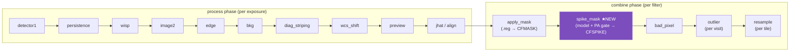
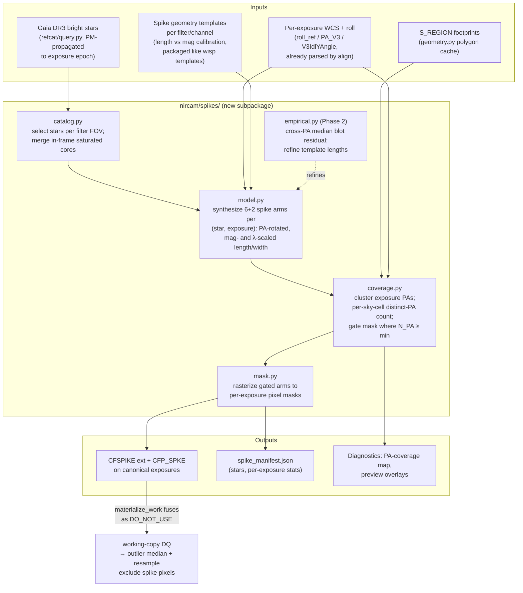
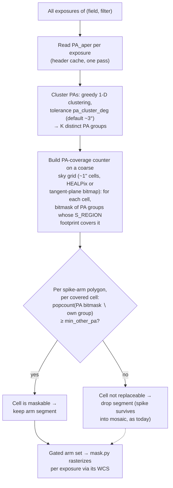
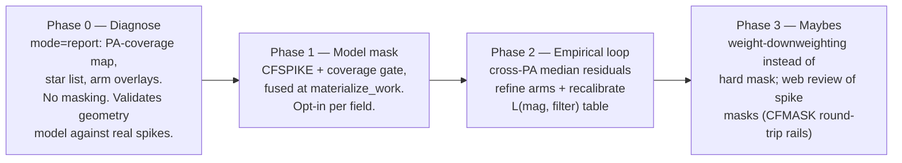

# Design: Automatic Diffraction-Spike Masking for Multi-PA NIRCam Fields

Status: **exploratory sketch** — no implementation yet. Stretch goal for future
NIRCam reductions.

## 1. Problem

Bright stars imprint diffraction spikes (six spikes at 60° spacing from the
hexagonal primary, plus the horizontal secondary-strut spike) that extend
arcminutes across NIRCam exposures at the bright end. In the mosaic they
produce spurious sources, corrupted photometry along the spike wings, and
false structure in background maps.

The pipeline currently has no automatic defense against them:

- **Outlier detection can't see them — structurally.** `outlier` groups
  exposures per visit with intra-program overlap padding
  (`nircam/steps/outlier.py`). Every exposure in such a group shares one
  telescope roll, so a spike sits at the *same sky position* in every input.
  It is perfectly self-consistent, survives the median, and is never flagged.
  This is not a tuning problem; it's the grouping itself.
- **Manual `.reg` masks** (`apply_mask` → `CFMASK`) work but don't scale to
  fields with hundreds of bright stars and thousands of exposures.

**The multi-PA opportunity.** Spikes rotate with the telescope V3 position
angle; the sky does not. In densely-imaged fields assembled from multiple
programs/epochs (COSMOS-Web-style), most pixels are covered at ≥2 distinct
PAs. A pixel under a spike at PA₁ is clean in the PA₂ exposures — so spike
pixels can be *masked outright* in the exposures where they're contaminated,
and the mosaic still has full sky coverage from the other roll(s). Where only
one PA exists, masking would punch holes in the mosaic, so the mask must be
**coverage-gated**.

This is the same "earns its keep only at high N" regime as `bad_pixel`, and
the design borrows its posture: **disabled by default, opted in per field.**

## 2. Where it sits in the pipeline

A new per-filter ensemble step, `spike_mask`, in the **combine phase**,
between `apply_mask` and `bad_pixel`:

```python
COMBINE_STEPS = [
    ('apply_mask', 'CFP_MASK'),
    ('spike_mask', 'CFP_SPKE'),   # NEW — per-filter ensemble, gated on multi-PA coverage
    ('bad_pixel',  'CFP_BPIX'),
    ('outlier',    'CFP_OUT'),
    ('resample',   None),
]
```

Rationale for the slot:

- **Combine, not process.** The step is inherently an *ensemble* decision —
  the gate ("is this sky region covered at another PA?") depends on the whole
  filter's exposure set, which isn't knowable per-exposure during the process
  phase. It also wants post-`wcs_shift`/`jhat`/`align` WCS quality.
- **Before `outlier`.** Fusing spike pixels into the working DQ as
  `DO_NOT_USE` removes them from the cross-exposure median
  (`good_bits='~DO_NOT_USE'`), so the outlier median is no longer biased by
  spike wings on overlap regions — the two steps reinforce each other.
- **After `apply_mask`.** Manual `.reg` masks stay the last word for anything
  the automatic step misses; the two masks are independent extensions and
  simply OR together at `materialize_work` time.



### Non-destructive contract (the CFMASK pattern)

`spike_mask` writes a **`CFSPIKE`** extension (uint8, 0/1) on each canonical
exposure and stamps `CFP_SPKE`. The canonical's SCI/DQ are untouched.
`Field.materialize_work` fuses `CFSPIKE` into the working DQ as `DO_NOT_USE`,
exactly as it already does for `CFMASK`. Consequences, all inherited for free:

- Mask edits/re-runs are fully reversible — `CFSPIKE` is rebuilt from scratch.
- The canonical stays deploy/review-clean (byte-identical modulo the added
  extension).
- Exposures with no spike coverage get `CFP_SPKE = 'no bright stars'` (the
  `apply_mask` "ran-but-n/a" convention) so `status` reads correctly.

## 3. Architecture

Two stages: a **model-driven** mask (Phase 1, a priori geometry from a bright-
star catalog) optionally refined by an **empirical** cross-PA residual
detector (Phase 2). Both feed a shared **coverage gate**.



### 3.1 Bright-star catalog (`catalog.py`)

- Primary source: **Gaia DR3** via the existing `refcat/query.py` backend
  (astroquery, `mag_band="G"`), with proper-motion propagation to the
  exposure epoch — `refcat/motion.py` already does this for alignment.
  Query once per field (cone from the union footprint), cache under the
  field's reference dir alongside the alignment refcat.
- Selection: `G < mag_limit` (per-channel default, e.g. SW ~ 15.5, LW ~ 15;
  tunable). Spike length is a steep function of magnitude, so the faint
  cutoff mostly controls mask *count*, not mask *area*.
- Fallback / supplement: in-frame detection of saturated cores
  (`SATURATED` DQ clusters) catches red sources that are spike-bright in
  LW but faint in Gaia G. Positions from the cluster centroid; "effective
  magnitude" from the saturated-core radius.

### 3.2 Spike geometry model (`model.py`)

Per (star, exposure), synthesize the arm set analytically — no PSF
simulation (WebbPSF is far too heavy for this, and spike *cores* don't need
sub-pixel fidelity, only conservative footprints):

- 6 primary arms at 60° spacing with orientation
  `θ_sky = PA_aper + θ₀`, where `PA_aper` comes from the same
  `roll_ref`/`V3IdlYAngle`/`vparity` chain `align/apply.py` and
  `outlier_detect.py` already compute per exposure.
- +2 shorter horizontal secondary-strut arms (the "+" overlay on the "✕").
- Arm length `L(mag, filter)` and width `W(mag, filter)`: empirical
  power-law/log-linear fits **calibrated once from existing reductions**
  (measure radial extent of spike flux above threshold for a sample of
  Gaia stars across mag/filter) and shipped as a small packaged table —
  the wisp-template pattern (`wisp_cache`-style manifest if the table
  outgrows the wheel; it won't — it's a few KB of coefficients).
- Everything is rendered as **capsule polygons in sky coordinates first**
  (shapely, consistent with `geometry.py`), because the coverage gate
  operates on the sky, then projected per-exposure for rasterization.
- Optionally include the saturated core + halo as a central disk arm-0.

### 3.3 The PA-coverage gate (`coverage.py`) — the heart of the design

The invariant: **never mask a pixel that no other-PA exposure can replace.**



Notes:

- The gate is computed **in sky coordinates once per filter**, not per
  exposure — arms are clipped against the "maskable" region, then the
  clipped geometry is projected into each exposure. Cheap, and guarantees
  cross-exposure consistency: the same sky segment is either masked in
  *all* exposures of the contaminated PA group or in none.
- Coarse cells (~1") are fine: S_REGION is only good to ~1" anyway
  (`geometry.py` already documents this), and the gate is a coverage
  question, not astrometry.
- A refinement worth keeping in mind: an arm from a star at PA₁ can overlap
  an arm from the *same* star at PA₂ near the star (arms cross at the
  core). Cells where the candidate replacement exposures are *themselves*
  spike-flagged should not count as coverage. Practically: compute all arm
  sets first, subtract each PA group's own spike footprint from its
  coverage contribution, then gate. This makes the core region (all PAs
  contaminated) correctly un-maskable → it stays a job for `apply_mask` or
  simply saturation DQ.
- `min_other_pa = 1` (default): at least one clean PA group must cover the
  cell. Fields observed at a single PA get an empty gate everywhere and the
  step becomes a no-op with a clear log line — safe to leave enabled in
  shared config, but still ship `enabled = false` by default (bad_pixel
  precedent).

### 3.4 Empirical refinement (`empirical.py`, Phase 2)

The model mask is deliberately conservative; real spikes vary (filter
ghosts, PSF breathing, scattered-light features). Phase 2 closes the loop
with data:

- Build a **cross-PA median** per spike neighborhood: reuse the
  campfire-native drizzle primitives (`drizzle.drizzle_tile_singles`,
  `MedianComputer`, blot — all built for `outlier_step_campfire`) over a
  small tangent-plane stamp around each bright star, drawing inputs from
  *all* PA groups. Spikes don't stack across PAs, so the median is
  spike-suppressed.
- Blot back to each exposure; flag elongated positive residuals **within a
  corridor around the predicted arm directions** (the model constrains the
  search, killing false positives from real extended sources).
- Output feeds two places: (a) per-exposure mask refinement (extend/trim
  arms), and (b) accumulated `L(mag, filter)` measurements that recalibrate
  the packaged template table over time.

This is strictly additive — Phase 1 is useful alone, and Phase 2 never runs
for single-PA fields (no cross-PA median exists).

## 4. Configuration

```toml
[nircam.spike_mask]
    enabled = false            # opt in per field, like [nircam.bad_pixel]
    mag_limit_sw = 15.5        # Gaia G cutoff, SW filters
    mag_limit_lw = 15.0        # Gaia G cutoff, LW filters
    include_saturated = true   # supplement catalog with in-frame saturated cores
    pa_cluster_deg = 3.0       # exposures within this roll tolerance = one PA group
    min_other_pa = 1           # distinct other-PA groups required to gate a cell in
    grow = 2                   # binary dilation (px) on the rasterized mask
    mode = "mask"              # "mask" (DO_NOT_USE) | "report" (diagnostics only)
```

Parametric-only, per the config contract — it controls *how* the step runs;
whether it runs at all follows the same `enabled` opt-in pattern as
`bad_pixel`. `mode = "report"` is the Phase-0 dry-run: produce the coverage
map, manifest, and overlays without writing `CFSPIKE`.

## 5. Products & provenance

| Product | Location | Notes |
|---|---|---|
| `CFSPIKE` extension | canonical exposure FITS | uint8; rebuilt every run |
| `CFP_SPKE` stamp | canonical primary header | value records mag limits + gate params, or "n/a" reason |
| `spike_manifest.json` | `products/nircam/<field>/<filter>/` | star list, PA groups, per-exposure masked-pixel counts; follows `manifest.py` conventions (input hashes → cheap re-run skip) |
| PA-coverage map | field reference dir | small FITS/PNG diagnostic: distinct-PA count per sky cell — independently useful for survey planning |
| Preview overlays | filter products dir | predicted arms drawn over the existing `preview` PNGs |

Effects downstream, all via existing mechanisms: `outlier` and `resample`
exclude the pixels through `good_bits='~DO_NOT_USE'`; `expmap`/WHT drop
accordingly (honest depth accounting — masked spike area at single-PA depth
shows as reduced weight, not fabricated data).

## 6. Phasing



Phase 1 ships as an **Algorithm** changelog entry (MINOR — it changes pixel
values in the mosaic for fields that enable it, even though the default-off
config means no change for existing fields until opted in). Phase 0 alone is
Infrastructure (PATCH).

## 7. Open questions

1. **Hard mask vs. downweight.** DO_NOT_USE is simple and rides existing
   rails, but discards spike-wing pixels that still carry ~90% valid flux far
   from the core. A downweight mode would need to touch resample weight
   handling (more invasive; deferred to Phase 3, and only if Phase 1 depth
   maps show it matters).
2. **Saturated-core handling.** The core/halo region is typically
   contaminated at *every* PA and thus never gated in. Do we want an
   ungated central-disk option (`mask_core = true`) that accepts the mosaic
   hole, or leave cores to DQ saturation + manual masks? Leaning: leave it
   out of scope; the feature is about *spikes*.
3. **PA grouping vs. per-visit outlier interaction.** Should `outlier` gain
   an optional cross-PA grouping mode instead? Rejected for now: the
   redundant-drizzle scaling problem that motivated intra-program grouping
   (see `outlier.py`) comes right back, and spikes are better handled
   deterministically than statistically. But Phase 2 deliberately reuses the
   same drizzle/median/blot primitives, so the machinery converges.
4. **Astrometric epoch for arms.** Arms rotate about the star, so mask
   accuracy near the arm tip is sensitive to PA error, not star position.
   S_REGION-level (~1") accuracy suffices given `grow`; no need to wait for
   `align` refinement — but running after it in the combine phase gets the
   better WCS for free anyway.
5. **Filter dependence of the strut spikes.** The horizontal strut arms are
   weak in SW, prominent in LW; the calibration table should allow per-arm,
   per-filter zero lengths so SW configs don't over-mask.

## 8. Summary of touchpoints

| Area | Change |
|---|---|
| `nircam/orchestrate.py` | add `('spike_mask', 'CFP_SPKE')` to `COMBINE_STEPS`; per-filter ensemble runner (bad_pixel pattern) |
| `nircam/spikes/` (new) | `catalog.py`, `model.py`, `coverage.py`, `mask.py`, `empirical.py` (Phase 2) |
| `nircam/field.py` | `materialize_work`: fuse `CFSPIKE` alongside `CFMASK` |
| `nircam/steps/outlier.py` | none (benefits automatically via DQ) |
| `refcat/` | reuse `query.py` / `motion.py`; possibly a thin cached "bright stars" wrapper |
| `data/config_default.toml` | `[nircam.spike_mask]` section |
| packaged data | spike length/width calibration table (few KB) |
| `steps/preview.py` | optional arm-overlay hook (Phase 0) |
