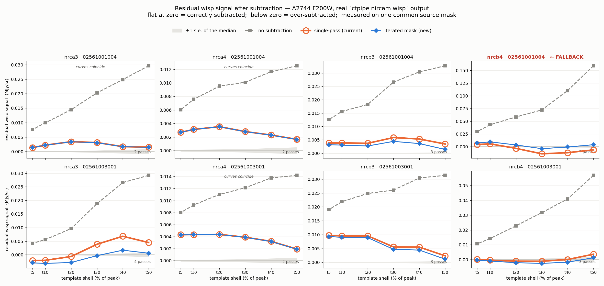
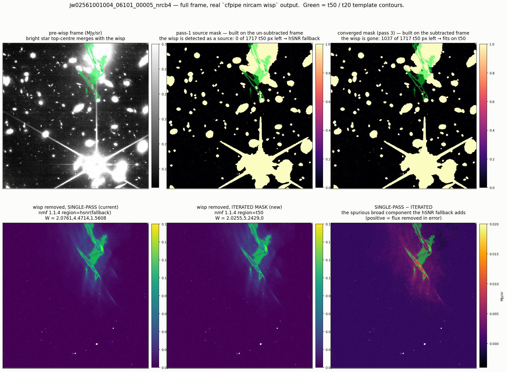

# The NMF wisp fit was masking itself: A2744 F200W nrcb4

**Branch:** `claude/nircam-wisp-mask-iteration`
**Date:** 2026-08-14
**Verdict:** the wisp source mask must be iterated. Single-pass masking
under-subtracts every bright wisp and, at the bright end, starves the fit
region entirely and hands the exposure to the `MASK_hSNR` fallback that
PR #456 exists to avoid.

Trigger: `jw02561001004_06101_00005_nrcb4` (A2744, F200W, program 2561) was the
only frame in the A2744 set stamping `region=hsnr(fallback)`, and it carried by
far the largest amplitudes (`W = 2.0761, 4.4714, 1.5608` against a 0.21–1.75
spread everywhere else). It was visibly over-subtracted.

## 1. Method

The frames on disk are post-`image2`, so the pre-wisp rate frame cannot be
recovered by adding `W · templates` back (that would mix DN/s into MJy/sr
across the flat and `PHOTMJSR`). The exposure was instead rebuilt from `uncal`
in an isolated root, `$CAMPFIRE_ROOT/abtest/a2744_wispfb`, through `detector1`
only — `persistence` writes DQ, which the wisp fit never reads, so the
`detector1` output *is* the frame the step sees.

Everything below is measured on that frame. The A/B is the real step: the
pre-wisp frames were snapshotted, then `cfpipe nircam wisp` was run twice,
once with `mask_iterations = 1` and once with the new default, and the
resulting FITS compared.

## 2. Why it falls back

The source mask is built once, from the frame that still contains the wisp.
`detect_sources(nsigma=3, dilate=8)` therefore treats a bright enough wisp as a
source and masks the very pixels the amplitude solve scores.

| | fallback frame | control (`003001_00006_nrcb4`) |
|---|---|---|
| sky | 0.1119 DN/s | 0.1095 |
| pixel σ | 0.0124 | 0.0129 |
| `detect_threshold(nsigma=3)` − sky | **0.0452** | 0.0462 |
| median wisp excess over `t50` | **0.0946 (7.6 σ)** | 0.0311 (2.4 σ) |
| `t50` detected as source | **97.6% raw → 100% after dilate** | 8.7% → 40.8% |
| `t50 & ~mask` (threshold 150) | **0 px** | 1016 px |

The detection threshold sits *between* the two frames: this wisp core is 2.1×
above it, the control's is below. Nothing about the frame is exotic — it is
simply a brighter-than-usual wisp.

A bright star at the top of the frame compounds it: one segment (164,210 px,
peak 34.6 DN/s, bbox y[1426:2043] x[1024:1559]) covers 1651 of the 1717 `t50`
pixels, because the star's halo and the wisp merge into a single connected
component. But the counterfactual is clean — once the wisp is subtracted, 1037
of 1717 `t50` px survive that same star, far above the 150-px threshold. The
star is not the cause; self-detection is.

Lowering the `50 × ncomp` threshold does not help (the region is at 0 px, not
58). Neither does a region ladder `t50 → t30 → t20`: only 3278 of 17,645 `t30`
px survive the pass-1 mask and they are all the outskirts, so the `t30` fit
under-subtracts the core by 31% (model median over `t50` 0.0507 vs 0.0733
converged). The ladder is a fine seed, not a fix.

## 3. What the fallback then does

hSNR is 523k px of which ~90% is background, so the solve pays for the fit with
a spurious broad third component (`W₃ = 1.56`). Residual excess by template
shell, all three arms measured on **one common source mask** and each against
its own far-field sky (comparing each arm on its own mask flatters the
difference and is wrong):

```
                      t50      t40      t30      t20      t10   (DN/s)
none              +0.08841 +0.06132 +0.04019 +0.03250 +0.02401
single-pass       -0.00344 -0.00651 -0.00772 -0.00180 +0.00314
iterated          +0.00220 -0.00033 -0.00212 +0.00194 +0.00533
```

A −0.006…−0.014 MJy/sr bowl over the wisp footprint, peaking at 0.024 MJy/sr of
flux removed in error, where every other frame in the set sits at +0.001 to
+0.005. This is precisely the failure mode the `t50` default was introduced to
remove, re-entered through the fallback.

## 4. The fix

Re-detect sources on the wisp-subtracted frame and re-fit until the model
settles within 1% of its peak (`[nircam.wisp].mask_iterations`, default 5).
Subtracting even a bad first model drops the wisp below the detection
threshold, so pass 2 recovers the region.

- **Converges in 2–4 passes**, ~1 s per extra pass.
- **Seed-independent**: starting from the bad hSNR fallback and from a `t30`
  fit land within 2% of each other (`med(model|t50)` 0.0733 vs 0.0716).
- Convergence is tested on the **model**, not on `W`. The components are
  near-degenerate and NNLS trades amplitude between them freely — `nrca3` walks
  `[0.76,0.62,1.50] → [1.43,0,0.89] → [1.72,0,0]` while the model it implies
  moves under 1%. A `W`-based test warns "did not settle" on a fit that
  converged three passes earlier.

On the pathological frame the fit returns to `region=t50`
(`W = 2.0255, 5.2429, 0`) and its residual profile joins the rest of the set.





## 5. Blast radius

The iteration is **not** gated on the fallback, because the bias is not binary —
it scales with wisp brightness and the fallback is only its endpoint. Across 4
wisp detectors × 2 A2744 F200W exposures (real `cfpipe nircam wisp` output,
`mask_iterations` 1 vs 5):

| frame | single-pass | iterated | note |
|---|---|---|---|
| `001004_00005_nrcb4` | `hsnr(fallback)`, W=2.08,4.47,1.56 | `t50`, W=2.03,5.24,0 | 3 passes; the bowl is gone |
| `003001_00006_nrca3` | `t50`, +0.0068 MJy/sr at `t40` | +0.0018 | 4 passes; never fell back, still biased |
| `001004_00005_nrcb3` | W=1.7468 | W=1.8682 | 3 passes |
| `003001_00006_nrcb3` | W=1.7422 | W=1.8155 | 3 passes |
| `003001_00006_nrcb4` | W=0.839,0.724,0.736 | W=0.890,0.657,0.748 | 3 passes |
| `001004_00005_nrca3` | W=1.199,0.125,0.677 | W=1.200,0.127,0.680 | 2 passes, no-op |
| `001004_00005_nrca4` | W=1.0571 | W=1.0586 | 2 passes, no-op |
| `003001_00006_nrca4` | W=1.1874 | W=1.1900 | 2 passes, no-op |

Six improve toward zero residual, two are unchanged, none degrade. Gating on
the fallback would fix one frame and leave the systematic under-subtraction in
every bright-wisp frame — hence **Calibration / MINOR**, implying a re-run of
wisp → image2 → bkg → combine for the SW wisp detectors.

`nmf_correct_1f` is untouched: nmfwisp owns that solve and always fits
hSNR/ivar internally, so there is nothing there to iterate that this work can
validate. It stamps `passes=1`.

## 6. Reproducing

```bash
# isolated root, one exposure per detector, detector1 only
CAMPFIRE_ROOT=$CAMPFIRE_ROOT/abtest/a2744_wispfb \
  cfpipe nircam detector1 --field a2744 --filters f200w -p 6

# A/B the real step
cfpipe nircam wisp --field a2744 --filters f200w --overwrite \
  --config $CAMPFIRE_ROOT/abtest/a2744_wispfb/config/config_legacy.toml   # mask_iterations = 1
cfpipe nircam wisp --field a2744 --filters f200w --overwrite \
  --config $CAMPFIRE_ROOT/abtest/a2744_wispfb/config/config_iter.toml     # default
```

Diagnostics and plotting scripts: `$CAMPFIRE_ROOT/scripts/claude/wisp-fallback/`
(`fair.py` is the common-mask residual comparison, `converge.py` the
seed-independence test, `proof_profiles.py` / `proof_frame.py` the figures).
